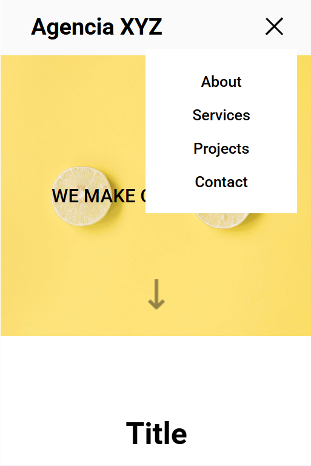

# Landing_Page_Com_Grid

The purpose of this project is to create a landing page with grid and flex.

#### Links:
*  [Live Site URL:](https://carlab09.github.io/landing-page/)

#### Results:
*  View the optimal layout for the page depending on their device's screen size
*  See hover states for all interactive elements on the page

#### Technologies used:
*  HTML
*  CSS

## Conclusion

I am very pleased to have completed this project.
Grid is a great tool, and it is relatively easy.

#### Design_Desktop:

#### Design_Mobile:

